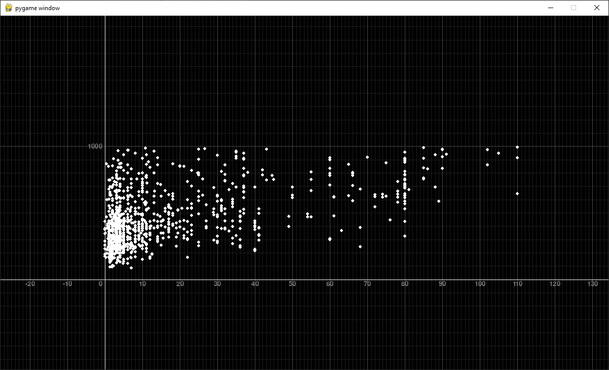
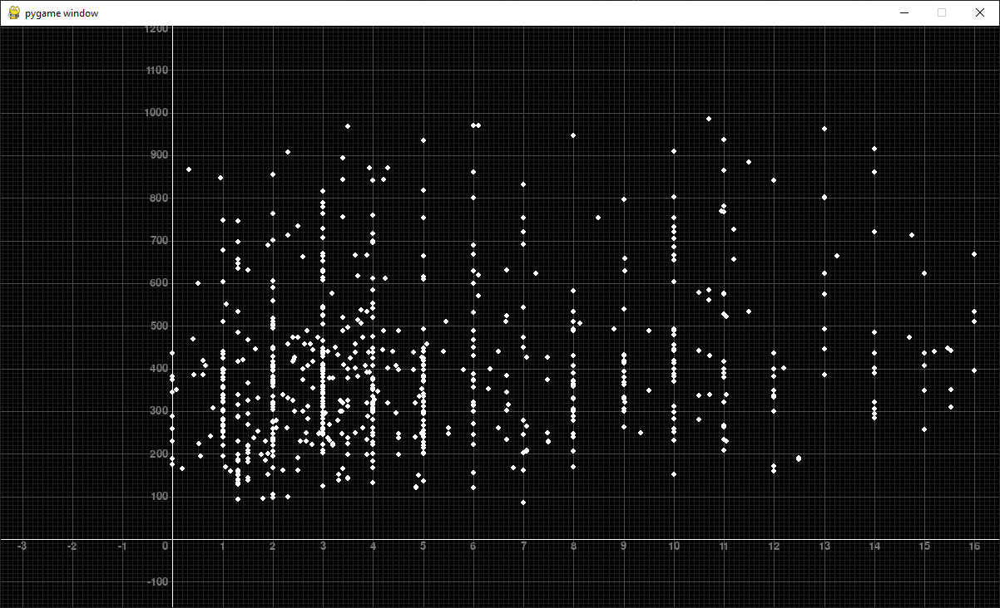

## Управление:
---

```
- основное
    - ЛКМ + перетаскивние:        перетаскивание
    - колесико:                   масштабирование

- масштаб осей по отдельности
    - LSHIFT + колесико:          масштабирование оси абцисс
    - LCTRL  + колесико:          масштабирование оси ординат
    - LSHIFT + клик на колесико:  приравнять масштаб оси абцисс к масштабу оси ординат    
    - LCTRL  + клик на колесико:  приравнять масштаб оси ординат к масштабу оси абцисс
```

## Примеры:
---




