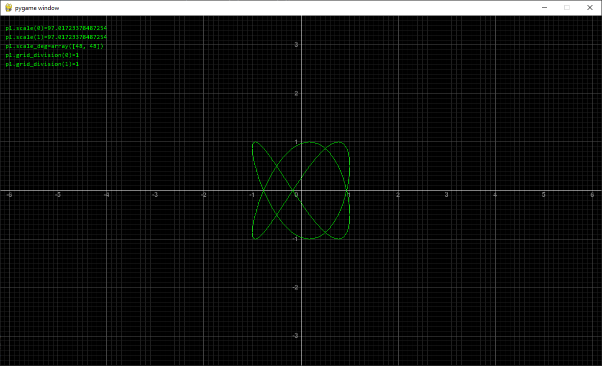
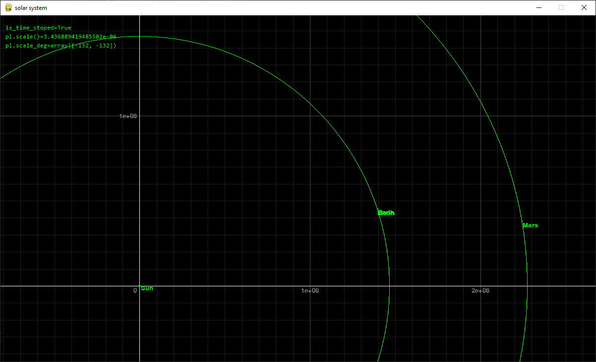
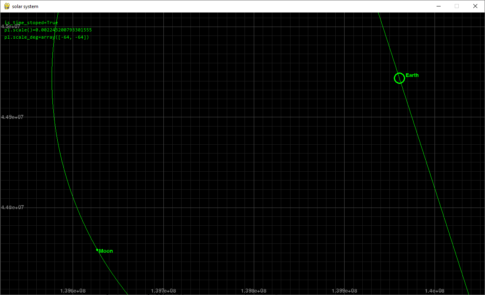

## Управление:

```
- основное
    - ЛКМ + перетаскивние:         перетаскивание
    - колесико:                    масштабирование

- масштаб осей по отдельности
    - LSHIFT + колесико:           масштабирование оси абцисс
    - LCTRL  + колесико:           масштабирование оси ординат
    - LSHIFT + клик на колесико:   приравнять масштаб оси абцисс к масштабу оси ординат    
    - LCTRL  + клик на колесико:   приравнять масштаб оси ординат к масштабу оси абцисс
```


## Примеры использования:






*значения на осях отображаются даже если оси оси за границами окна*


 


*оси можно масштабировать независимо друг от друга*