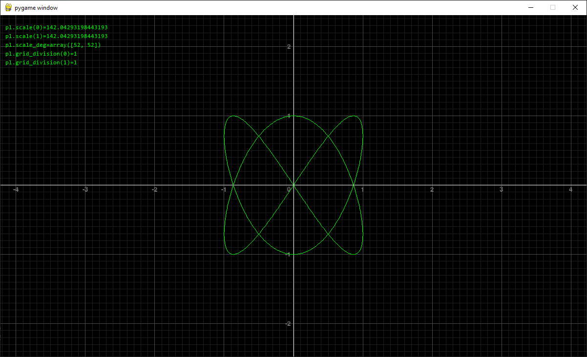

## Управление:

```
- основное
    - ЛКМ + перетаскивние:         перетаскивание
    - колесико:                    масштабирование

- масштаб осей по отдельности
    - LSHIFT + колесико:           масштабирование оси абцисс
    - LCTRL  + колесико:           масштабирование оси ординат
    - LSHIFT + клик на колесико:   приравнять масштаб оси абцисс к масштабу оси ординат    
    - LCTRL  + клик на колесико:   приравнять масштаб оси ординат к масштабу оси абцисс
```

 

## Примеры использования:



 

Значения на осях отображаются даже если сами оси за границами окна:


 

Оси можно масштабировать независимо друг от друга:

 


